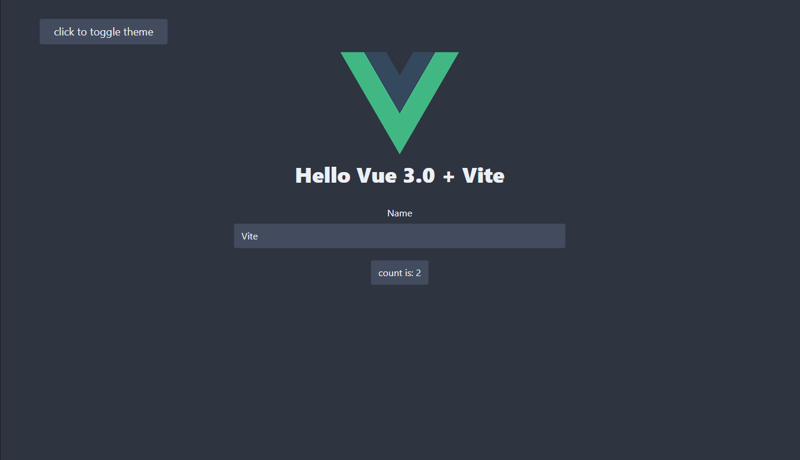

# VueBreeze

Vue 3, Typescript & Tailwindcss starter project.

💪🔨 Powered by [vite](https://github.com/vitejs/vite).

Including [custom-forms](https://github.com/tailwindlabs/tailwindcss-custom-forms), [typography](https://github.com/tailwindlabs/tailwindcss-typography), [tailwindcss-theming](https://github.com/innocenzi/tailwindcss-theming).

## Install

```bash
npx degit shiftgeist/vuebreeze my-new-project
```

## Preview


